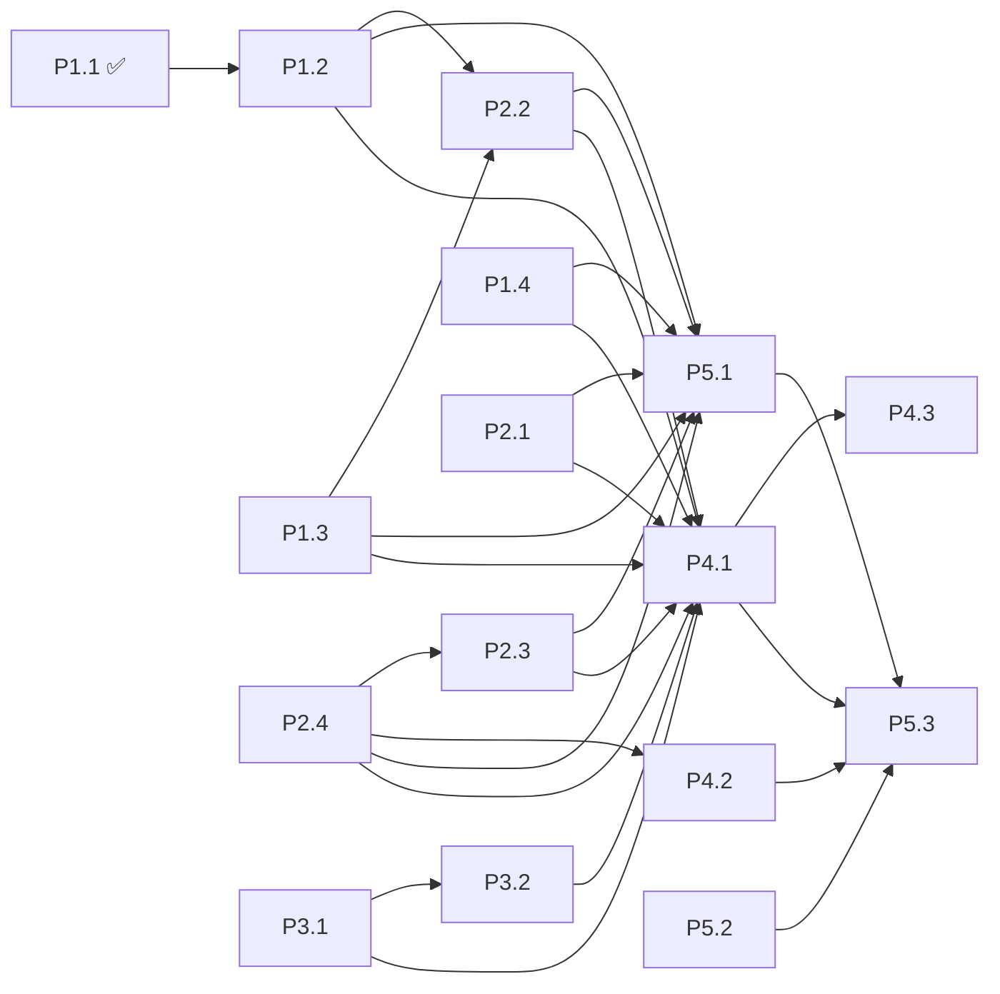

# TravelScout — Execution Specs (agent-native)

This directory turns [`docs/ROADMAP.md`](../ROADMAP.md) into **self-contained execution
specifications**. Each spec is written so that an AI agent (or a human) starting from a
**fresh session with zero conversation history** can pick up one task, implement it, verify
it, and open a PR — without asking questions.

> Repo facts an agent needs: this folder (`FlightChecker/`) is the private GitHub repo
> `mpmdw/TravelScout`. Push over **SSH** (`git push`); the `gh` CLI is **not** authenticated.
> Default branch: `main`. CI: `.github/workflows/ci.yml` (build + type-check on PR/push).

---

## How to execute a spec (the agent contract)

1. **Read the whole spec first**, then read every file in its *Files touched* table.
   Specs cite `file:line` against the tree at the time of writing — verify the cited code
   still looks as described; if it drifted, trust the code and adapt.
2. **One task = one branch = one PR.** Branch naming: `feat/<task-id>-<slug>`
   (e.g. `feat/p1.2-flight-status`). Never commit to `main` directly.
3. **Work the steps in order.** Steps are sequenced so the build stays green between them
   where possible.
4. **Run the Verification section verbatim** before opening the PR. Every spec's
   verification works **without any API keys** (shadow mode); steps that need a key or a
   human account are explicitly marked `HUMAN REQUIRED` and are never blocking for the PR.
5. **Tick the task's checkbox in `docs/ROADMAP.md`** in the same PR (and update the spec's
   Status field to `done`).
6. When you finish, your PR description must contain: the task ID, what changed, the
   verification output (paste the actual commands + results), and any handoff notes for
   dependent tasks.

## Global invariants (apply to EVERY task — violations are PR-blockers)

| # | Invariant | What it means concretely |
|---|---|---|
| G1 | **Shadow mode is sacred** | Every feature must keep working on mock data when its key is absent, and must **degrade to mock (never crash)** when a live call fails. Pattern: `has<Feature>()` flag in `src/lib/config.ts` → try live → catch → mock + `note`. |
| G2 | **No secrets in git** | Keys live only in `.env.local` (gitignored) / Vercel env. Never print keys in logs, notes, or error messages. |
| G3 | **Env vars are documented twice** | Any new env var goes in **both** `.env.example` (with a comment) **and** the README *Configuration* table, in the same PR. |
| G4 | **Disclaimers survive** | (a) airspace polygons are approximate / not for operational flight planning; (b) confirmation/PNR codes cannot be resolved by public APIs — status uses flight number + date. Do not delete or weaken these strings in UI, README, or provider notes. |
| G5 | **Build green before PR** | `npm run build` passes (it type-checks). Once P2.4 lands, `npm test` must also pass. |
| G6 | **Server-only keys** | No `process.env.<SECRET>` may be reachable from client components. Only `src/lib/**` (server) and API routes read config. |
| G7 | **API response compatibility** | The UI (`src/app/page.tsx`) reads `data.error` (string), `data.route`, `data.itineraries`/`data.source`/`data.note`, `data.intel`, `data.status`. Don't break these shapes without updating the UI in the same PR. |

## Task index & status

| Spec | Title | Status | Depends on | Touches (primary) |
|---|---|---|---|---|
| — | P1.1 Amadeus flight search | ✅ merged (`9258ee0`) | — | `src/lib/providers/{flights,amadeus}.ts` |
| [p1.2](./p1.2-flight-status.md) | Real flight-status adapter | open | P1.1 | `src/lib/providers/flightStatus.ts` |
| [p1.3](./p1.3-geo-intel-hardening.md) | Harden Claude geo-intel live path | open | — | `src/lib/providers/geoIntel.ts` |
| [p1.4](./p1.4-real-airspace-data.md) | Real airspace (FIR) data | open | — | `src/lib/dangerZones.ts`, `data/` |
| [p2.1](./p2.1-validation-error-envelope.md) | Zod validation + error envelope | open | — | `src/app/api/**`, `src/lib/validation.ts` |
| [p2.2](./p2.2-caching-backoff.md) | Caching + rate-limit/backoff | open | P1.1–P1.3 | `src/lib/{cache,geocode}.ts`, providers |
| [p2.3](./p2.3-avoidance-algorithm.md) | Multi-waypoint avoidance | open | P2.4 | `src/lib/geo.ts` |
| [p2.4](./p2.4-test-suite.md) | Vitest test suite | open | — | `tests/`, `vitest.config.ts`, `ci.yml` |
| [p3.1](./p3.1-auth-gate.md) | Productionize the access gate | open | — | `src/middleware.ts`, `src/lib/auth.ts` |
| [p3.2](./p3.2-security-headers.md) | Security headers + secret hygiene | open | P3.1* | `next.config.mjs` |
| [p4.1](./p4.1-vercel-deploy.md) | Deploy to Vercel | open | Phases 1–3 | `vercel.json`?, README |
| [p4.2](./p4.2-ci-cd.md) | CI/CD (lint+test+build+deploy) | open | P2.4 | `.github/workflows/ci.yml`, ESLint setup |
| [p4.3](./p4.3-observability.md) | Health, logging, error tracking | open | P4.1 | `src/app/api/health/`, instrumentation |
| [p5.1](./p5.1-ux-a11y-autocomplete.md) | States, a11y, mobile, autocomplete | open | Phases 1–2 | `src/app/page.tsx`, `globals.css` |
| [p5.2](./p5.2-map-polish.md) | Map polish | open | — | `src/components/MapView.tsx` |
| [p5.3](./p5.3-docs-demo.md) | Docs + demo | open | most phases | `README.md`, `docs/` |

\* P3.2 has no hard code dependency on P3.1, but both edit `src/middleware.ts` — land P3.1
first to avoid conflicts.

## Staged execution plan (waves)

Tasks inside a wave are independent and can run **in parallel** (separate branches).
A wave starts when every task it depends on has **merged**.

```
Wave 1  ─ P1.2, P1.3, P1.4, P2.1, P2.4, P5.2        (no unmet dependencies)
Wave 2  ─ P2.2 (←P1.2,P1.3), P2.3 (←P2.4), P4.2 (←P2.4), P3.1, P3.2 (←P3.1 merge order)
Wave 3  ─ P5.1 (←Phases 1–2 complete)
Wave 4  ─ P4.1 (←Phases 1–3 complete)               [HUMAN REQUIRED: Vercel account]
Wave 5  ─ P4.3 (←P4.1), P5.3 (last)
```



### Merge-order notes (conflict avoidance)
- **P2.1 rewrites all five API route files.** If P1.2/P1.3 are in flight at the same time,
  merge the provider PRs first and rebase P2.1 — provider PRs barely touch routes, so the
  rebase is cheap in that direction.
- **P2.2 refactors caching inside providers.** Start it only after P1.2 and P1.3 merge.
- **P3.1 and P3.2 both touch `src/middleware.ts`** — strictly sequence them.
- **P5.1 rewrites large parts of `page.tsx`** — don't run it concurrently with anything
  else that edits the page.

## Critical path

`P1.2 → P2.2`, and `P2.4 → P2.3` feed Phase-2 completion; then
`Phase 3 → P4.1 → P4.3 → P5.3 (launch)`. P4.2 only needs P2.4 and can land early.

## Spec anatomy (template all specs follow)

Every spec has these sections — agents can rely on the structure:

1. **Header table** — branch, dependencies, files touched, new env vars, human-required?
2. **Mission** — one paragraph, outcome-focused.
3. **Context — what exists today** — exact current behavior with `file:line` citations.
4. **Non-goals** — explicitly out of scope (usually: it's another task's job).
5. **Design decisions** — pre-made choices with rationale, so the agent doesn't deliberate.
6. **Execution plan** — ordered steps with file-level instructions, signatures, snippets.
7. **Acceptance criteria** — checkbox list mirroring the roadmap's *Done*.
8. **Verification** — copy-pasteable commands + expected output, keyless-first.
9. **Edge cases & failure modes** — what to handle, what to punt on.
10. **Handoff notes** — what later tasks will assume this task left behind.
11. **PR checklist** — the global invariants plus task-specific gates.

---

*Generated 2026-06-09 against commit `55302e2`. If the tree has drifted substantially,
re-verify Context sections before executing.*
